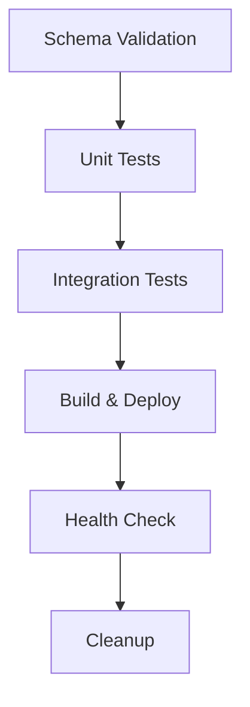

# 📋 Python Files Documentation - Model Registry Project

> **Mô tả chi tiết các file Python trong hệ thống Model Registry**  
> *Tài liệu này mô tả đầy đủ mục đích, chức năng và cách sử dụng của tất cả file Python trong project*

---

## 📊 Tổng Quan

Project **Model Registry** sử dụng **4 file Python chính** để thực hiện **testing, validation và monitoring** hệ thống database. Tất cả các file đều được tích hợp vào **GitLab CI/CD pipeline** và hỗ trợ **JUnit XML reporting**.

---

## 🧪 1. Unit Testing - `tests/run_unit_tests.py`

### 🎯 Mục Đích
Kiểm thử các **thành phần riêng lẻ** của hệ thống Model Registry để đảm bảo từng component hoạt động chính xác.

### ⚙️ Chức Năng Chính

#### **Stored Procedures Testing**
- `GET_MODEL_FEATURES` - Lấy danh sách features của model
- `REGISTER_NEW_MODEL` - Đăng ký model mới
- `CHECK_MODEL_DEPENDENCIES` - Kiểm tra phụ thuộc model

#### **Functions Testing**  
- `FN_CALCULATE_PSI` - Tính toán Population Stability Index
- `FN_VALIDATE_FEATURE` - Xác thực tính hợp lệ của feature

#### **Database Integrity Testing**
- Kiểm tra tồn tại của bảng cần thiết
- Xác thực tính toàn vẹn tham chiếu (referential integrity)
- Phát hiện bản ghi orphaned

### 💻 Cách Sử Dụng

```bash
# Chạy unit tests cơ bản
python tests/run_unit_tests.py --database MODEL_REGISTRY_TEST

# Chạy với output verbose và báo cáo XML
python tests/run_unit_tests.py \
  --database MODEL_REGISTRY_TEST \
  --server localhost \
  --output test-reports/unit-tests.xml \
  --verbose
```

### 🏗️ Cấu Trúc Class

```python
class ModelRegistryUnitTester:
    def __init__(self, connection_string: str)
    def test_stored_procedure(self, proc_name: str, test_cases: list)
    def test_function(self, func_name: str, test_cases: list)
    def validate_result(self, result, expected, validation_type)
    def test_basic_queries(self)
    def generate_junit_xml(self, output_path: str)
```

### 📈 Kết Quả Đầu Ra
- **Console Output**: Status real-time của từng test
- **JUnit XML**: Báo cáo cho CI/CD integration
- **Exit Codes**: 0 (success), 1 (failure)

---

## 🔄 2. Integration Testing - `tests/run_integration_tests.py`

### 🎯 Mục Đích
Kiểm thử **quy trình đầu cuối** (end-to-end workflows) và tích hợp giữa các thành phần của hệ thống.

### ⚙️ Chức Năng Chính

#### **Model Lifecycle Workflow**
```sql
1. Đăng ký model mới → REGISTER_NEW_MODEL
2. Thêm kết quả validation → MODEL_VALIDATION_RESULTS  
3. Kiểm tra dependencies → CHECK_MODEL_DEPENDENCIES
4. Lấy features → GET_MODEL_FEATURES
```

#### **Feature Management Workflow**
```sql
1. Đăng ký feature mới → FEATURE_REGISTRY
2. Thêm thống kê → FEATURE_STATS
3. Xác thực feature → FN_VALIDATE_FEATURE
```

#### **Monitoring Workflow**
```sql
1. Tạo cấu hình monitoring → MODEL_MONITORING_CONFIG
2. Chạy kiểm tra performance → SP_CHECK_MODEL_PERFORMANCE
```

#### **Data Quality Workflow**
```sql
1. Log vấn đề chất lượng → MODEL_DATA_QUALITY_LOG
2. Cập nhật trạng thái khắc phục
3. Theo dõi và báo cáo
```

#### **Cross-System Integration**
- Kiểm tra mối quan hệ giữa models, features, validation results
- Test functionality của các views hệ thống
- Xác minh tích hợp các components

### 💻 Cách Sử Dụng

```bash
# Chạy integration tests
python tests/run_integration_tests.py --database MODEL_REGISTRY_TEST

# Chạy đầy đủ với báo cáo
python tests/run_integration_tests.py \
  --database MODEL_REGISTRY_TEST \
  --server localhost \
  --output test-reports/integration-tests.xml \
  --verbose
```

### 🏗️ Workflow Tests

| Test Name | Mô Tả | Thành Phần Kiểm Tra |
|-----------|-------|---------------------|
| `model_lifecycle_workflow` | Quy trình hoàn chỉnh của model | Registration → Validation → Monitoring |
| `feature_workflow` | Quản lý feature từ A-Z | Registration → Stats → Validation |
| `monitoring_workflow` | Hệ thống giám sát model | Config → Performance Check |
| `data_quality_workflow` | Quy trình chất lượng dữ liệu | Logging → Tracking → Resolution |
| `cross_system_integration` | Tích hợp liên hệ thống | Views → Relationships → Dependencies |

### 📊 Test Results Format
```
✓ model_lifecycle_workflow: Complete model lifecycle workflow executed successfully
✓ feature_workflow: Feature workflow executed successfully  
✓ monitoring_workflow: Monitoring workflow executed successfully
⚠ data_quality_workflow: Skipped - Missing required tables
✗ cross_system_integration: ERROR - View VW_MODEL_PERFORMANCE not found
```

---

## 🏥 3. Health Check - `tests/health_check.py`

### 🎯 Mục Đích
Kiểm tra **sức khỏe hệ thống** sau deployment và trong quá trình vận hành để phát hiện sớm các vấn đề.

### ⚙️ Chức Năng Chính

#### **Database Connectivity**
```python
def check_database_connectivity(self):
    """Test basic database connectivity"""
    result = self.execute_query("SELECT GETDATE() as CurrentTime")
    # ✓ Database connectivity: OK (Server time: 2025-06-20 14:30:15)
```

#### **Essential Tables Check**
```python
essential_tables = [
    'MODEL_TYPE', 'MODEL_REGISTRY', 'FEATURE_REGISTRY',
    'MODEL_VALIDATION_RESULTS', 'FEATURE_STATS', 'MODEL_SOURCE_TABLES'
]
# ✓ Essential tables: All 6 tables present and accessible
```

#### **Critical Procedures Check**
```python
critical_procedures = [
    'GET_MODEL_FEATURES', 'REGISTER_NEW_MODEL', 'CHECK_MODEL_DEPENDENCIES'
]
# ✓ Critical procedures: All 3 procedures available
```

#### **Data Integrity Check**
- Orphaned models (models without valid model type)
- Inactive model types
- Models without validation results
- Foreign key constraint violations

#### **Monitoring System Check**
```sql
-- Kiểm tra bảng monitoring
MODEL_MONITORING_CONFIG, MODEL_MONITORING_ALERTS

-- Kiểm tra cấu hình active
SELECT COUNT(*) FROM MODEL_MONITORING_CONFIG WHERE IS_ACTIVE = 1
```

#### **Performance Metrics**
```sql
-- Database size
SELECT SUM(CAST(FILEPROPERTY(name, 'SpaceUsed') AS bigint) * 8192) / 1024 / 1024 as DB_SIZE_MB

-- Recent activity  
SELECT COUNT(*) FROM MODEL_REGISTRY WHERE CREATED_DATE >= DATEADD(DAY, -30, GETDATE())
```

#### **Recent Deployments**
```sql
SELECT TOP 5 DEPLOYMENT_DATE, ENVIRONMENT, VERSION, STATUS
FROM DEPLOYMENT_LOG ORDER BY DEPLOYMENT_DATE DESC
```

### 💻 Cách Sử Dụng

```bash
# Health check cơ bản
python tests/health_check.py --database MODEL_REGISTRY

# Exit với error code nếu có warning
python tests/health_check.py \
  --database MODEL_REGISTRY \
  --server localhost \
  --exit-on-warning
```

### 📋 Health Status Levels

| Status | Ý Nghĩa | Action Required |
|--------|---------|-----------------|
| `HEALTHY` | ✅ Hệ thống hoạt động bình thường | Không cần hành động |
| `WARNING` | ⚠️ Có vấn đề nhỏ, cần theo dõi | Kiểm tra và monitor |
| `CRITICAL` | 🚨 Vấn đề nghiêm trọng | Cần khắc phục ngay lập tức |

### 📊 Sample Health Check Output

```
==================================================
MODEL REGISTRY HEALTH CHECK
==================================================
Check time: 2025-06-20 14:30:15

✓ Database connectivity: OK (Server time: 2025-06-20 14:30:15)
✓ Essential tables: All 6 tables present and accessible
✓ Critical procedures: All 3 procedures available
✓ Data integrity: No issues detected
✓ Monitoring system: 15 active configurations
ℹ Database size: 2.3 GB
ℹ Recent activity: 25 models created in last 30 days

==================================================
OVERALL HEALTH STATUS: HEALTHY
==================================================

✓ No issues detected - System is healthy
```

---

## 🔍 4. Schema Validation - `scripts/validate_schema.py`

### 🎯 Mục Đích
Xác thực **cấu trúc database schema** để đảm bảo tính nhất quán và chính xác của thiết kế database.

### ⚙️ Chức Năng Chính

#### **SQL Files Parsing**
```python
def parse_sql_files(self):
    """Parse all SQL schema files to extract table and dependency information"""
    # Đọc tất cả file .sql trong thư mục schema
    # Trích xuất định nghĩa bảng và relationships
```

#### **Dependencies Validation**
```python
def validate_dependencies(self):
    """Validate that all foreign key dependencies exist"""
    # Kiểm tra foreign key references
    # Phát hiện circular dependencies
    # Xác định thứ tự tạo bảng
```

#### **Naming Conventions**
```python
def validate_naming_conventions(self):
    """Validate naming conventions"""
    # Table names: UPPER_CASE_WITH_UNDERSCORES
    # Column names: consistent pattern
    # Constraint names: proper prefixes
```

#### **Dependency Order Generation**
```python
def generate_dependency_order(self) -> List[str]:
    """Generate correct order for table creation based on dependencies"""
    # Topological sort của dependencies
    # Đảm bảo parent tables được tạo trước child tables
```

### 💻 Cách Sử Dụng

```bash
# Validate schema cơ bản
python scripts/validate_schema.py

# Với custom schema path và output
python scripts/validate_schema.py \
  --schema-path database/schema \
  --output test-reports/schema-validation.xml \
  --verbose
```

### 🏗️ Schema Validation Features

| Feature | Description |
|---------|-------------|
| **Table Analysis** | Phân tích cấu trúc bảng và cột |
| **Foreign Key Check** | Xác thực tính hợp lệ của foreign keys |
| **Circular Dependencies** | Phát hiện vòng lặp trong dependencies |
| **Naming Standards** | Kiểm tra tuân thủ naming conventions |
| **Creation Order** | Xác định thứ tự tạo bảng optimal |

### 📊 Validation Report

```
Schema Validation Report
========================
Total tables found: 15
Errors: 0
Warnings: 2

Warnings:
  - Table MODEL_TEMP uses non-standard naming pattern
  - Missing index on FEATURE_REGISTRY.SOURCE_SYSTEM

✓ All dependencies are valid
✓ No circular dependencies detected
✓ Creation order determined successfully
```

---

## 🔄 5. CI/CD Integration

### 🛠️ GitLab Pipeline Stages

```yaml
# .gitlab-ci.yml structure
stages:
  - validate      # Schema validation
  - test         # Unit & Integration tests  
  - build        # Documentation & packages
  - deploy       # Staging/Production deployment
  - notify       # Results notification
  - cleanup      # Test databases cleanup
```

### 📋 Pipeline Jobs

| Stage | Job | Script | Artifacts |
|-------|-----|--------|-----------|
| **validate** | `schema_validation` | `validate_schema.py` | `schema-validation.xml` |
| **test** | `unit_tests` | `run_unit_tests.py` | `unit-tests.xml` |
| **test** | `integration_tests` | `run_integration_tests.py` | `integration-tests.xml` |
| **deploy** | `health_check` | `health_check.py` | Health status report |

### 🎯 Test Execution Flow



### 📊 JUnit XML Reports

Tất cả Python scripts đều tạo **JUnit XML reports** tương thích với GitLab CI:

```xml
<testsuite name="Model Registry Unit Tests" tests="15" failures="0" errors="1">
  <testcase name="GET_MODEL_FEATURES_test_1" classname="ModelRegistryUnitTests">
    <system-out>Test getting features for valid model</system-out>
  </testcase>
  <testcase name="check_essential_tables" classname="ModelRegistryUnitTests">
    <error message="Missing tables: [TEMP_TABLE]">
      Table validation failed
    </error>
  </testcase>
</testsuite>
```

---

## 🔧 6. Common Parameters & Options

### 📝 Shared Arguments

| Parameter | Required | Default | Description |
|-----------|----------|---------|-------------|
| `--database` | ✅ | N/A | Database name to connect to |
| `--server` | ❌ | `localhost` | SQL Server instance |
| `--output` | ❌ | `test-reports/*.xml` | Output path for XML reports |
| `--verbose` | ❌ | `False` | Enable detailed output |

### 🔐 Connection String Format

```python
connection_string = f"DRIVER={{ODBC Driver 17 for SQL Server}};SERVER={server};DATABASE={database};Trusted_Connection=yes;"
```

### 🎯 Exit Codes

| Code | Meaning | Used By |
|------|---------|---------|
| `0` | Success - All tests passed | All scripts |
| `1` | Failure - Some tests failed | Unit/Integration tests |
| `2` | Critical - System unhealthy | Health check only |

---

## 📊 7. Performance & Best Practices

### ⚡ Performance Considerations

- **Connection Pooling**: Reuse database connections
- **Parameterized Queries**: Prevent SQL injection
- **Transaction Management**: Auto-commit for test isolation
- **Resource Cleanup**: Always close connections

### 🛡️ Security Features

```python
# Parameterized queries
cursor.execute("SELECT * FROM MODEL_REGISTRY WHERE MODEL_ID = ?", (model_id,))

# Connection string với Windows Authentication
"Trusted_Connection=yes"

# Error handling để không expose sensitive info
except Exception as e:
    raise Exception(f"Query execution failed: {e}")
```

### 📋 Best Practices

1. **Test Isolation**: Mỗi test case cleanup data của chính nó
2. **Idempotent Tests**: Tests có thể chạy nhiều lần với kết quả giống nhau  
3. **Verbose Logging**: Detailed output cho debugging
4. **CI Integration**: JUnit XML cho GitLab reporting
5. **Error Handling**: Graceful failure với meaningful messages

---

## 🚀 8. Usage Examples

### 🔄 Complete Testing Workflow

```bash
# 1. Validate schema trước khi test
python scripts/validate_schema.py --verbose

# 2. Chạy unit tests
python tests/run_unit_tests.py \
  --database MODEL_REGISTRY_TEST \
  --output reports/unit-tests.xml \
  --verbose

# 3. Chạy integration tests  
python tests/run_integration_tests.py \
  --database MODEL_REGISTRY_TEST \
  --output reports/integration-tests.xml \
  --verbose

# 4. Health check sau deployment
python tests/health_check.py \
  --database MODEL_REGISTRY_PROD \
  --exit-on-warning
```

### 🎯 CI/CD Integration Example

```yaml
# GitLab CI Job
unit_tests:
  stage: test
  script:
    - python tests/run_unit_tests.py --database $TEST_DB --output unit-tests.xml
  artifacts:
    reports:
      junit: unit-tests.xml
    paths:
      - unit-tests.xml
    expire_in: 1 week
  only:
    - develop
    - main
```

### 📊 Monitoring Integration

```bash
# Scheduled health checks (cron job)
*/30 * * * * cd /opt/model-registry && python tests/health_check.py --database MODEL_REGISTRY_PROD --exit-on-warning

# Email notification on failure
python tests/health_check.py --database PROD --exit-on-warning || mail -s "Model Registry Health Check Failed" admin@company.com < /dev/null
```

---

## 📚 9. Troubleshooting

### ❌ Common Issues

#### **Database Connection Failed**
```
Failed to connect to database: [Microsoft][ODBC Driver 17 for SQL Server][SQL Server]Login failed
```
**Solution**: Kiểm tra connection string, credentials, và network connectivity

#### **Missing Tables/Procedures**
```
⚠ Missing essential tables: ['MODEL_MONITORING_CONFIG']
```
**Solution**: Chạy deployment scripts để tạo missing objects

#### **Permission Denied**
```
Query execution failed: The SELECT permission was denied on the object 'MODEL_REGISTRY'
```
**Solution**: Grant appropriate permissions cho test user

### 🔧 Debug Mode

```bash
# Enable verbose output for detailed debugging
python tests/run_unit_tests.py --database TEST_DB --verbose

# Check specific test case
python -c "
import sys; sys.path.append('tests')
from run_unit_tests import ModelRegistryUnitTester
tester = ModelRegistryUnitTester('connection_string')
tester.test_stored_procedure('GET_MODEL_FEATURES', [test_case])
"
```

---

## 📈 10. Future Enhancements

### 🎯 Planned Features

- **Parallel Test Execution**: Chạy tests đồng thời để tăng tốc độ
- **Test Data Management**: Automated test data generation
- **Performance Benchmarking**: Track execution time trends
- **Advanced Reporting**: HTML reports với charts và metrics
- **Mock Data Support**: Test với synthetic data
- **Database Versioning**: Schema migration testing

### 🔄 Continuous Improvement

- **Metrics Collection**: Test execution times, success rates
- **Automated Optimization**: Self-tuning test parameters
- **AI-Powered Analysis**: Intelligent failure pattern detection
- **Integration Extensions**: Support thêm các CI/CD platforms

---

## 📞 11. Support & Maintenance

### 👥 Team Responsibilities

| Role | Responsibility |
|------|----------------|
| **DevOps Team** | CI/CD pipeline maintenance, infrastructure |
| **QA Team** | Test case development, validation scenarios |
| **Database Team** | Schema changes, performance optimization |
| **Development Team** | Feature testing, bug fixes |

### 📧 Contact Information

- **Primary Maintainer**: Database Team
- **CI/CD Support**: DevOps Team  
- **Emergency Contact**: On-call rotation

---

*📝 Tài liệu này được cập nhật thường xuyên. Phiên bản mới nhất có tại: `docs/PYTHON_FILES_DESCRIPTION.md`*

*🔄 Last Updated: June 20, 2025*